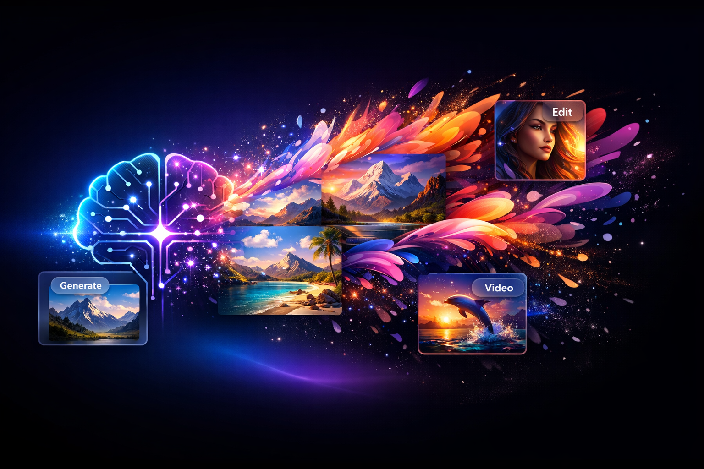

# Image Creator 🎨



**An AI-powered image and video generation platform.** Create stunning visuals from text prompts, edit and enhance images with AI, generate short videos, and organize everything in collections — all from a sleek, modern interface.

Built by a team of AI agents (Nova, Pixel, Bolt, Scout) orchestrated through [NinjaTech AI](https://www.ninjatech.ai/).

---

## ✨ Features

- **Text-to-Image Generation** — Generate high-quality images from natural language prompts using Gemini and GPT models
- **Model Comparison** — Compare outputs from multiple AI models side-by-side
- **Image Editing Suite** — Inpainting, outpainting, background removal, upscaling, watermarking, and style transfer
- **AI Video Generation** — Create short AI-generated videos from text or images using Sora
- **Prompt Enhancement** — AI-powered prompt refinement for better results
- **Gallery & Collections** — Browse, search, and organize generated images into collections
- **Brand Kits** — Save brand guidelines (colors, fonts, style) for consistent generation
- **Character Profiles** — Create reusable character descriptions for consistent characters across images
- **Style Presets** — Save and apply custom style presets to any generation
- **Batch Generation** — Upload a CSV to generate multiple images at once
- **Export Options** — Download as PNG, SVG, or animated GIF
- **Product Photography** — Generate professional product photos with custom scenes
- **Depth Maps** — Generate depth maps from existing images
- **Undo/Redo History** — Full edit history with undo and redo support
- **Dark/Light Theme** — Toggle between dark and light modes

---

## 🛠 Tech Stack

| Layer | Technology |
|-------|-----------|
| **Frontend** | Next.js, React, TypeScript, Tailwind CSS |
| **Backend** | Python, FastAPI |
| **AI Models** | Gemini Image, GPT Image, Sora (video), Claude Sonnet (chat) |
| **Gateway** | NinjaTech LiteLLM model gateway |

---

## 📁 Project Structure

```
image-creator/
├── frontend/          # Next.js frontend app (port 3000)
├── backend/           # FastAPI backend API (port 8000)
├── utils/             # AI model utility library (chat, images, video, embeddings)
├── generated-images/  # Stored generated images + JSON databases
├── generated-videos/  # Stored generated videos
└── requirements.txt   # Python dependencies
```

---

## 🚀 Getting Started

### Prerequisites

- Python 3.11+
- Node.js 20+
- Access to NinjaTech AI model gateway

### Backend

```bash
pip install -r requirements.txt
uvicorn backend.main:app --host 0.0.0.0 --port 8000
```

### Frontend

```bash
cd frontend
npm install
npm run dev
```

The frontend runs on port **3000** and the backend API on port **8000**.

---

## 📡 API

The backend exposes a REST API at `/api/` with endpoints for:

| Endpoint | Description |
|----------|-------------|
| `POST /api/generate` | Generate images from text prompts |
| `POST /api/enhance-prompt` | AI-enhance a prompt for better results |
| `POST /api/compare-models` | Generate with multiple models side-by-side |
| `GET /api/images` | List all generated images |
| `GET /api/images/{id}` | Get image details |
| `POST /api/images/{id}/edit` | Edit an existing image |
| `POST /api/images/{id}/upscale` | Upscale an image |
| `POST /api/images/{id}/remove-bg` | Remove image background |
| `POST /api/images/{id}/outpaint` | Extend image canvas |
| `POST /api/videos/generate` | Generate video from text prompt |
| `POST /api/videos/from-image` | Generate video from an image |
| `GET /api/collections` | Manage image collections |
| `GET /api/brand-kits` | Manage brand kits |

Full interactive docs available at `/docs` when the backend is running.